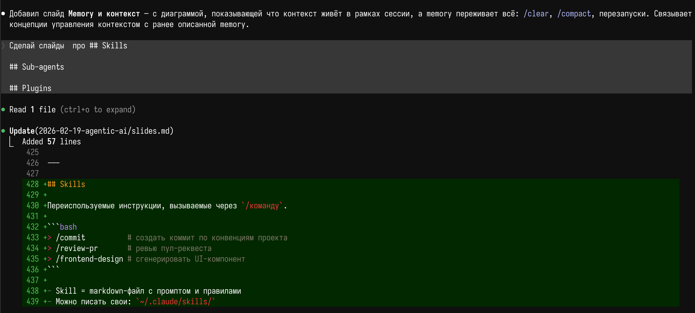
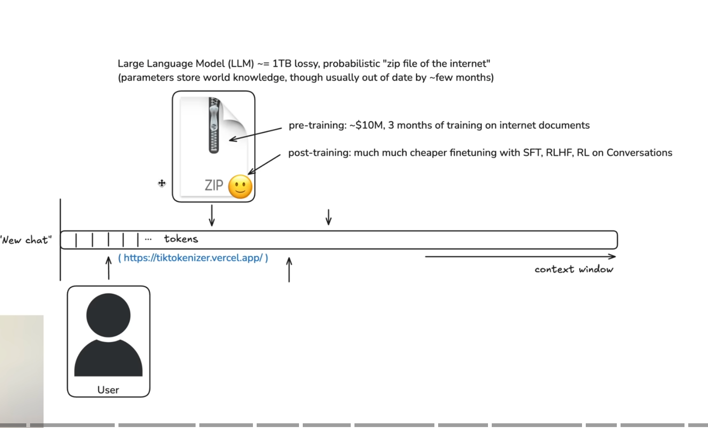
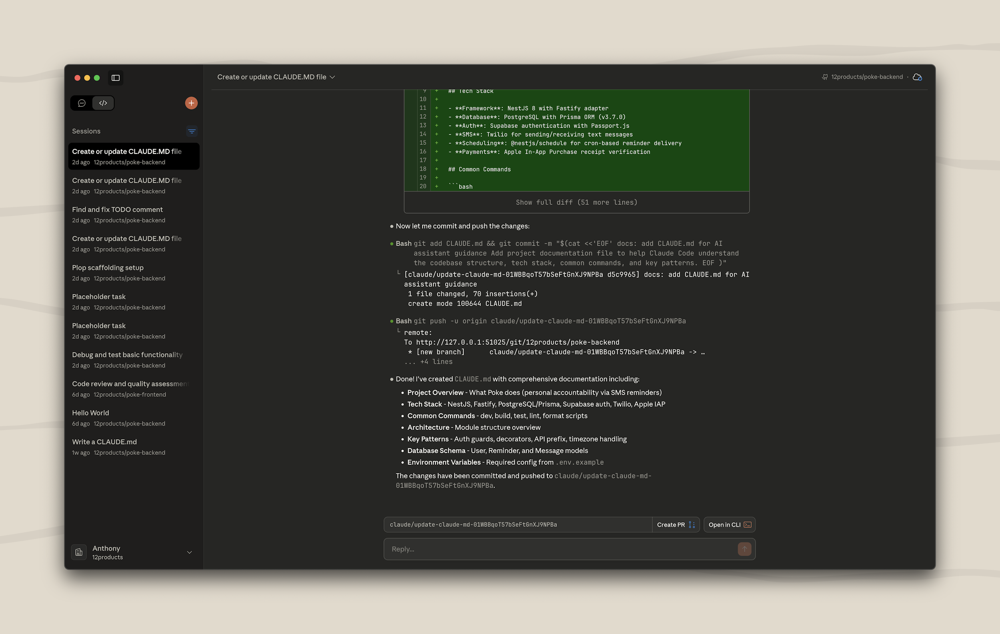
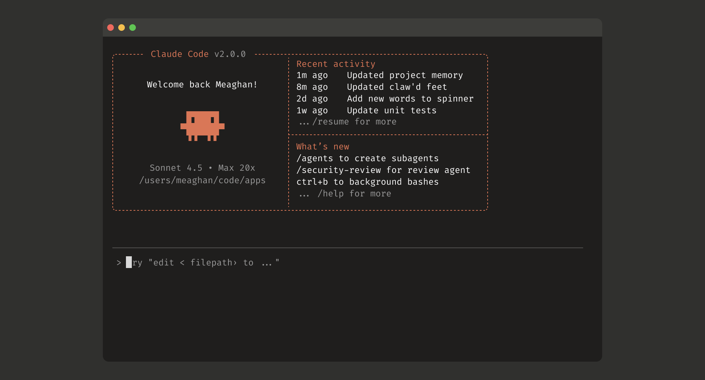

# Введение в агентскую разработку

**Антон Галицын**
2026-02-19

---

## Содержание

- Проблема
- Сценарии использования
- Теория: LLM, агенты
- Claude Code
- Выводы
- С чего начать

---

## Эволюция ИИ-инструментов

| Год | Инструмент | Что изменилось |
|-----|-----------|----------------|
| 2021 | GitHub Copilot | Автодополнение кода в IDE |
| 2022 | ChatGPT GPT-3.5 | Диалоговый режим — код через чат |
| 2023 | GPT-4, Copilot Chat | Чат встроен в IDE |
| 2024 | Cursor | Агент редактирует файлы и выполняет команды в IDE |
| 2025 | Claude Code, Codex, OpenCode | Множественные агенты в терминале — планируют, пишут, тестируют |

---

## Проблема

Большинство разработчиков попробовали ИИ на уровне **ChatGPT (GPT-3.5)** в 2022–2023:

- Генерировал **плоский**, часто неработающий код
- Не знал контекст проекта — каждый раз с нуля
- Галлюцинировал API, которых не существует
- Ответы устаревали через пару месяцев

**Вывод:** «ИИ — игрушка, для реальной работы не годится».

С тех пор сменилось **3 поколения** моделей и инструментов.

---

## После релиза Claude Sonnet 3.7 (февраль 2025) ИИ инструменты перестали быть игрушкой

[🔗](https://www.anthropic.com/news/claude-3-7-sonnet)

---

## За последний месяц


---

<!-- _class: lead -->

## Сценарии использования

---

## Эта презентация



---

## Одноразовый скрипт

Не нужно писать скрипт — опиши задачу, агент напишет и выполнит.

```bash
> проверь доступность всех endpoints в k8s namespace production,
  покажи какие поды рестартовали за последние 24 часа
  и есть ли OOMKilled
```

Агент сам:
1. Напишет bash/python скрипт
2. Запустит его
3. Проанализирует вывод
4. Покажет итог человеческим языком

---

### Работа с файлами

```bash
> прочитай все yaml файлы в deploy/ и найди
  где захардкожены IP-адреса
> переименуй все .jsx файлы в .tsx и обнови импорты
> собери из 20 CSV-файлов сводную таблицу по регионам
```

- Читает, ищет, редактирует файлы любого формата
- Массовые операции: переименование, замена, миграция
- Анализ: поиск паттернов, дубликатов, несоответствий
- Парсинг: CSV, JSON, YAML, TOML, XML, логи

Агент видит содержимое файлов — не просто `sed`, а с пониманием контекста.

---

### Дебаг и диагностика

```bash
> вот ошибка из CI, почини:
  FAIL src/auth/token.test.ts
  TypeError: Cannot read properties of undefined (reading 'exp')
> проанализируй логи в /var/log/app.log за последний час,
  найди причину 502 ошибок
```

Агент:
1. Читает стектрейс и находит проблемный код
2. Анализирует контекст вокруг ошибки
3. Предлагает и применяет фикс
4. Запускает тесты для проверки

---

## Code review

```bash
> проревьюй PR #123
> найди баги и уязвимости в @src/api/
> проверь соответствие код-стайлу проекта
```

- Находит баги, race conditions, утечки ресурсов
- Проверяет обработку ошибок и edge cases
- Указывает на нарушения конвенций из `CLAUDE.md`
- Предлагает конкретные исправления, а не абстрактные советы

---

## Разработка кода

```bash
> добавь REST API для управления заказами:
  CRUD эндпоинты, валидация, пагинация, тесты
```

Агент сам:
1. Изучит структуру проекта и существующие паттерны
2. Создаст модели, хэндлеры, роуты
3. Добавит валидацию и обработку ошибок
4. Напишет тесты и запустит их
5. Починит если что-то упало
6. Сделает коммит

Работает с любым стеком: Go, Python, TypeScript, Rust, ...
Следует конвенциям из `CLAUDE.md` и стилю существующего кода.

---

## Рефакторинг

```bash
> перенеси всю бизнес-логику из хэндлеров в сервисный слой
> замени все callback-функции на async/await
> извлеки общую логику валидации в отдельный пакет
```

- Понимает архитектуру — не сломает зависимости
- Переименование с обновлением всех ссылок
- Смена паттернов: MVC → Clean Architecture
- Запускает тесты после каждого шага

---

## Git-операции

```bash
> разреши merge-конфликты в пользу нашей ветки
> разбей последний коммит на 3 атомарных
> cherry-pick фикс из release/1.2 в main
```

- Резолв merge-конфликтов с пониманием кода
- Интерактивный rebase без `-i`
- Создание PR с описанием на основе диффа
- Сложные git-workflow: squash, cherry-pick, bisect

---

## Онбординг в кодовую базу

```bash
> объясни как работает система авторизации в этом проекте
> нарисуй зависимости между пакетами в src/
> какой путь проходит HTTP-запрос от роутера до БД?
```

- Агент читает код и строит объяснение
- Находит точки входа, ключевые абстракции
- Отвечает на вопросы по незнакомому проекту
- Заменяет часы чтения кода на 5-минутный диалог

---

## Миграции

```bash
> мигрируй с Express на Hono
> обнови все вызовы API v1 на v2
> переведи этот модуль с JavaScript на TypeScript
```

- Между фреймворками: React → Vue, Express → Hono
- Между версиями API: обновление контрактов
- Между языками: JS → TS, Python 2 → 3
- Обновляет импорты, типы, тесты — всё за один проход

---

## Генерация тестов

```bash
> напиши тесты для всех публичных методов в @src/services/
> добавь e2e-тесты для флоу регистрации
> покрой edge cases в @utils/parser.go
```

- Анализирует код и пишет осмысленные тесты
- Покрывает happy path, ошибки, граничные случаи
- Запускает тесты и чинит если падают
- Может держать тесты в актуальном состоянии и обновлять при изменении кода

---

## Документация

```bash
> сгенерируй README для этого проекта
> напиши API-документацию для всех эндпоинтов
> создай changelog на основе коммитов с прошлого релиза
```

- README с описанием, установкой, примерами
- API-документация из кода и комментариев
- Changelog из истории коммитов
- Обновление существующей документации при изменении кода

---

## Браузерная автоматизация

Агент + Playwright MCP = полный контроль над браузером.

```bash
> открой https://admin.example.com
> залогинься как test@example.com / password123
> перейди в раздел "Пользователи"
> найди пользователя с email broken@test.com
> сделай скриншот его профиля
> проверь консоль на ошибки
```

- Заполнение форм, клики, навигация
- Скриншоты для отчётов и дебага
- Чтение console.log и network-ошибок
- Работает с localhost и внешними сайтами

Автоматизация без единой строчки Selenium/Cypress.

---

<!-- _class: lead -->

## Немного теории

---

## Как работает LLM

```
           обучение (2024 и раньше)
                   │
    ┌──────────────▼──────────────┐
    │     Модель (веса, ~GBs)     │
    │  знания зафиксированы       │
    │  при обучении               │
    └──────────────┬──────────────┘
                   │
       ┌───────────▼───────────┐
       │   запрос (prompt)     │
       └───────────┬───────────┘
                   │
       ┌───────────▼───────────┐
       │  ответ (completion)   │
       │  токен за токеном     │
       └───────────────────────┘
```

Модель знает только то, на чём обучена.

---



---

## Актуальные знания

Знания модели **зафиксированы** в момент обучения:

| Модель | Knowledge cutoff |
|--------|-----------------|
| GPT-4o | апрель 2024 |
| Claude Opus 4 | начало 2025 |

Новые API, breaking changes, свежие версии библиотек — модель их не знает.

**llms.txt** — стандарт (Jeremy Howard, 2024): сайт публикует `/llms.txt` —
документацию в Markdown, оптимизированную для LLM.

Аналог `robots.txt`, но для ИИ.

---

## Контекстное окно

**Контекстное окно** — максимальный объём текста, который модель
видит за один запрос (prompt + ответ).

| Модель | Контекст | Дата |
|--------|----------|------|
| GPT-3.5 | 4K токенов | март 2023 |
| GPT-4 | 8K / 32K | март 2023 |
| Claude 3.5 Sonnet | 200K | июнь 2024 |
| GPT-4o | 128K | май 2024 |
| Claude Opus 4 | 200K | 2025 |

~1 токен ≈ 4 символа. 200K токенов ≈ **книга на 500 страниц**.

Всё что не влезает в окно — модель не видит.

---

## Думающие модели (Reasoning Models)

Обычная LLM отвечает сразу. Думающая модель сначала
**рассуждает** в скрытом блоке, потом даёт ответ.

```
prompt → [thinking... thinking... thinking...] → ответ
```

| Модель | Разработчик | Дата |
|--------|------------|------|
| o1 | OpenAI | сентябрь 2024 |
| DeepSeek R1 | DeepSeek | январь 2025 |
| Claude 3.7 Sonnet | Anthropic | февраль 2025 |
| Claude Opus 4 | Anthropic | май 2025 |

Больше времени на "думание" = лучше результат на сложных задачах.
Дороже и медленнее обычных моделей.

---

## Посмотреть

Andrej Karpathy - Intro to Large Language Models
[🔗](https://www.youtube.com/watch?v=zjkBMFhNj_g)

---

## Агенты

---

## System prompt

Скрытая инструкция модели **до** сообщения пользователя.

- Задаёт **роль** и **поведение** модели
- Определяет **ограничения** (язык, формат, тон)
- Передаёт **контекст**: описание проекта, правила
- Описывает **доступные инструменты** (tools)

> Впервые: **OpenAI**, март 2023 — параметр `system` в ChatGPT API (GPT-3.5)

---

## Tool use

**Tool use (function calling)** — модель генерирует JSON-вызов функции
вместо текста, когда ей не хватает информации или нужно выполнить действие.

> Впервые: **OpenAI**, июнь 2023 — function calling в GPT-3.5 / GPT-4

---

## Агент

**Агент** = system prompt + tools + цикл:

```
prompt → LLM → tool_use → результат → LLM → tool_use → ... → ответ
```

Модель сама решает какой инструмент вызвать, с какими параметрами и когда остановиться.

---

## Встроенные инструменты (Built-in Tools)

- **Файловые операции** — чтение, запись, поиск по кодовой базе
- **Команды терминала** — запуск тестов, сборок, деплоев
- **Git** — branch, commit, merge, rebase
- **Веб-поиск** — поиск актуальной документации и решений

Набор инструментов зашит в system prompt агента.

---

## MCP (Model Context Protocol)

Открытый протокол для подключения **внешних инструментов** к агенту.

> **Anthropic**, ноябрь 2024

- Единый стандарт: один MCP-сервер работает в любом агенте
- Примеры: GitHub, Jira, PostgreSQL, Playwright, Slack
- Агент вызывает MCP-инструмент так же, как встроенный tool_use

```
Агент → MCP клиент → MCP сервер → внешний сервис
```

---

<!-- _class: lead -->

## Claude Code

---

## Claude Desktop



---

## Claude Code — расширение VS Code


---

## Claude Code — CLI



---

## /init

Команда для инициализации проекта. Анализирует кодовую базу и создаёт `CLAUDE.md`.

```bash
$ claude
> /init
```

Claude сканирует:
- Структуру проекта и файлы
- Языки, фреймворки, зависимости
- Команды сборки и тестирования
- Стиль кода и конвенции

Результат — готовый `CLAUDE.md` с контекстом проекта.

---

## CLAUDE.md

Файл с инструкциями для агента, загружается в system prompt **автоматически**.

```markdown
# Project: my-app
Tech stack: Go, PostgreSQL, Docker
Build: make build
Test: make test
Style: gofmt, 80 chars line limit
```

- Лежит в корне репозитория
- Агент читает его при каждом запуске
- Можно указывать правила, запреты, предпочтения
- Работает как `.editorconfig`, но для ИИ

---

Показать пример

---

## Memory

Персональная память агента **между сессиями**.

```
~/.claude/projects/<project>/memory/MEMORY.md
```

- Агент сам записывает паттерны и решения
- Можно попросить: *"запомни, что мы используем bun"*
- Можно попросить забыть: *"забудь про bun"*
- Не дублирует `CLAUDE.md` — хранит личные предпочтения

**CLAUDE.md** — правила проекта (для всей команды)
**Memory** — личные заметки (для конкретного разработчика)

---

## /model

Переключение модели прямо в сессии.

```bash
> /model
```

| Модель | Когда использовать |
|--------|--------------------|
| Sonnet 4.5 | Быстрые задачи, рефакторинг, вопросы |
| Opus 4.6 | Сложная архитектура, многошаговые задачи |
| Haiku 4.5 | Простые правки, генерация boilerplate |

- Sonnet — баланс скорости и качества (по умолчанию)
- Opus — максимальное качество, медленнее, дороже
- Haiku — самая быстрая и дешёвая

---

## Conversation

Каждый запуск `claude` — это **сессия** (conversation).

- Вся история сообщений хранится локально
- Контекстное окно заполняется по мере диалога
- Когда контекст переполняется — агент автоматически **сжимает** историю (`/compact`)
- Закрыл терминал — сессия сохранена, можно вернуться

```
сессия 1: "добавь авторизацию"  ← 47 сообщений, 2 часа
сессия 2: "почини тесты"        ← 12 сообщений, 15 минут
сессия 3: "обнови README"       ← 5 сообщений, 3 минуты
```

---

## /resume

Продолжение предыдущей сессии с полным контекстом.

```bash
$ claude --resume       # интерактивный выбор
> /resume               # внутри сессии
```

- Показывает список прошлых сессий с поиском
- Агент видит всю предыдущую переписку
- Полезно когда: прервался, переключился, пришёл на следующий день

Одна задача = одна сессия. Не смешивай разные задачи в одной сессии.

---

## Управление контекстным окном

Контекст — самый ценный ресурс агента. Чем точнее контекст, тем лучше результат.

```
┌─────────────────────────────────┐
│ system prompt + CLAUDE.md       │
│ memory                          │
│ описание tools                  │
│ ─────────────────────────────── │
│ сообщение 1                     │
│ сообщение 2                     │
│ ...                             │
│ сообщение N      ← вы тут      │
│                                 │
│ ░░░░░░ свободно ░░░░░░░░░░░░░░ │
└─────────────────────────────────┘
         200K токенов
```

Проблема: контекст конечен, мусор в нём снижает качество.

---

## @ — добавление контекста

Указывает агенту **конкретные** файлы и папки для работы.

```bash
> объясни логику в @src/auth/middleware.ts
> что в @src/components/       # папка целиком
> сравни @old.go и @new.go
```

- Fuzzy-поиск: `@auth` найдёт `auth.js`, `AuthService.ts`
- Можно указать строки: `@app.ts#5-10`
- Выделенный код в IDE подхватывается автоматически

Без `@` агент сам ищет нужные файлы — тратит время и контекст.

---

## /clear

Полная очистка контекста текущей сессии.

```bash
> /clear
```

- Удаляет **всю** историю сообщений
- System prompt и CLAUDE.md остаются
- Сессия продолжается, но с чистого листа

Когда использовать:
- Переключаешься на другую задачу в той же сессии
- Контекст засорён нерелевантной информацией
- Агент начал "путаться" в длинном диалоге

---

## /compact и auto-compact

**/compact** — сжатие истории: агент пересказывает диалог кратко.

```bash
> /compact                    # сжать сейчас
> /compact сохрани контекст про auth  # сжать с подсказкой
```

**Auto-compact** — срабатывает автоматически при ~95% заполнения окна.

```
до:  100 сообщений, 180K токенов
     ↓ compact
после: резюме на 20K токенов + свободно 180K
```

- Агент сам решает что важно, а что можно отбросить
- Можно подсказать что сохранить
- `/clear` — жёсткий сброс, `/compact` — мягкое сжатие

---

## Memory и контекст

`/clear` и `/compact` теряют детали. Memory — нет.

```
     сессия 1           сессия 2           сессия 3
    ┌─────────┐        ┌─────────┐        ┌─────────┐
    │ контекст│        │ контекст│        │ контекст│
    │ (живёт  │        │ (живёт  │        │ (живёт  │
    │  здесь) │        │  здесь) │        │  здесь) │
    └────┬────┘        └────┬────┘        └────┬────┘
         │                  │                  │
         └──────────────────┴──────────────────┘
                            │
                    ┌───────▼───────┐
                    │    Memory     │
                    │  (живёт       │
                    │   всегда)     │
                    └───────────────┘
```

- Контекст — **временный**, в рамках одной сессии
- Memory — **постоянная**, переживает `/clear`, `/compact`, перезапуск
- Агент сам пишет в memory важные находки
- Вы можете попросить: *"запомни это"* / *"забудь это"*

---

## Permissions

Агент **спрашивает разрешение** перед каждым действием. Можно настроить:

```json
"permissions": {
    "allow": ["Read", "Glob", "Grep"], // Выполняет без вопросов
    "deny": ["Bash(rm *)"], // Блокирует всегда
    "ask": ["Bash", "Write"] // Спрашивает каждый раз (по умолчанию)
}
```

Агент **не может** обойти запрет — permissions проверяются на клиенте, до отправки запроса.

---

## Sensitive Data

Агент видит **все файлы** в рабочей директории. Исключения задаются явно:

```json
"fileExclusions": [
    ".env",
    "*.pem",
    "credentials.json",
]
```

Что защищать:
- **Токены и ключи** — `.env`, API keys, SSH-ключи
- **Сертификаты** — `*.pem`, `*.key`, TLS-файлы
- **Учётные данные** — `credentials.json`, `kubeconfig`
- **Персональные данные** — дампы БД, логи

Файлы из `fileExclusions` **не попадают в контекст** — агент их не видит, не читает, не предлагает изменить.

---

## Sub-agents

Агент может запускать **дочерних агентов** для параллельной работы.

```
главный агент
├── sub-agent: исследуй архитектуру auth
├── sub-agent: найди все TODO в коде
└── sub-agent: проверь зависимости
```

- Каждый sub-agent — отдельный контекст
- Работают параллельно, не мешают друг другу
- Главный агент собирает результаты
- Защищают основной контекст от переполнения

Примеры: code-reviewer, code-explorer, code-architect

---

## Skills

Переиспользуемые инструкции, вызываемые через `/команду`.

```bash
> /commit          # создать коммит по конвенциям проекта
> /review-pr       # ревью пул-реквеста
> /frontend-design # сгенерировать UI-компонент
```

- Skill = markdown-файл с промптом и правилами
- Можно писать свои: `~/.claude/skills/`
- Могут быть жёсткими (TDD — следуй точно) или гибкими (паттерны — адаптируй)
- По сути — **макросы для агента**

---

## Plugins

Расширения для Claude Code от сообщества и команд.

```bash
> /plugins                    # управление плагинами
> claude plugins install ...  # установка из маркетплейса
```

- **Plugin** = набор skills + tools + настройки
- Устанавливаются из маркетплейсов (GitHub-репо)
- 3 уровня установки:
  - **для пользователя** — во всех проектах
  - **для проекта** — для всей команды
  - **локально** — только для вас, только тут

Plugins — способ делиться навыками агента между командами.

---

## Примеры plugins

```bash
> /frontend-design         # генерация UI-компонентов
> /generate-image          # генерация изображений (nanobanana)
> /review-pr               # ревью пул-реквеста
> /commit                  # коммит по конвенциям проекта
```

Каталог готовых skills: **skills.sh**

- Устанавливаются одной командой
- Можно писать свои и публиковать
- Skill = markdown-файл с промптом — порог входа минимальный

---

Показать пример

---

## MCP в Claude Code

Ранее мы говорили про MCP — протокол подключения внешних инструментов.
В Claude Code MCP-серверы добавляются одной командой:

```bash
$ claude mcp add postgres-server \
    --transport http \
    http://localhost:3333
```

- Конфигурация сохраняется в `~/.claude/settings.json`
- Агент видит MCP-инструменты наравне со встроенными
- `/mcp` — управление серверами внутри сессии

---

## MCP: PostgreSQL

Агент работает с базой данных напрямую.

```bash
> опиши схему таблицы users
> найди пользователей без заказов за последний месяц
> создай миграцию: добавь колонку email_verified
```

- Выполняет SQL-запросы через MCP
- Анализирует схему и данные
- Генерирует миграции на основе реальной структуры БД
- Можно ограничить права: только SELECT, без DROP

---

## MCP: Playwright

Агент управляет браузером: тестирует, скриншотит, автоматизирует.

```bash
> открой localhost:3000 и проверь консоль на ошибки
> сделай скриншот страницы /login
> заполни форму регистрации и нажми submit
```

- Открывает страницы, кликает, заполняет формы
- Делает скриншоты и анализирует их
- Читает console.log и network-запросы
- Идеально для: отладки UI, e2e-тестов, визуальной проверки

---

## MCP: Context7

MCP-сервер: подтягивает **актуальную** документацию библиотек в контекст агента.

```bash
> как использовать useFormStatus в React 19? use context7
```

- Документация **текущей версии**, а не из тренировочных данных
- Поддерживает 1000+ библиотек: React, Next.js, Vue, Go, Python...
- Open source, бесплатный

```
Агент → Context7 MCP → документация библиотеки → актуальный ответ
```

---

<!-- _class: lead -->

## Агентская разработка

---

## Режимы работы

| Режим | Поведение |
|-------|-----------|
| **Default** | Спрашивает разрешение на каждое действие |
| **Plan** | Составляет план, ждёт одобрения, потом выполняет |
| **Auto-accept** | Редактирует файлы без подтверждения |
| **Bypass** | Выполняет всё без ограничений (включая shell) |

Переключение: клик по индикатору режима или через настройки.

`Default → Plan → Auto-accept` — по мере роста доверия к агенту.

---

## REPL-режим

Интерактивный диалог: запрос → результат → следующий запрос.

```
вы:    добавь эндпоинт GET /api/users
агент: [создаёт файл, пишет код]
вы:    добавь пагинацию
агент: [дополняет код]
вы:    напиши тесты
агент: [пишет и запускает тесты]
```

- Вы контролируете **каждый шаг**
- Видите промежуточный результат
- Корректируете направление на ходу
- Подходит для: исследования, прототипов, незнакомый код

---

## Plan Mode

Агент сначала **планирует**, потом выполняет.

```
вы:    реализуй авторизацию через JWT
агент: [исследует кодовую базу]
агент: вот мой план:
       1. Создать middleware auth.go
       2. Добавить генерацию токенов
       3. Обновить роутер
       4. Написать тесты
вы:    ок, делай  (или: измени пункт 2)
агент: [выполняет весь план]
```

- Агент сам читает код, строит план, ждёт одобрения
- Вы видите **полную картину** до начала работы
- Подходит для: фичи, рефакторинг, многофайловые изменения

---

## REPL vs Plan Mode

| | REPL | Plan Mode |
|---|------|-----------|
| Контроль | На каждом шаге | До начала и после |
| Скорость | Медленнее (много итераций) | Быстрее (один проход) |
| Контекст | Тратится на диалог | Тратится на план |
| Когда | Не знаешь что нужно | Знаешь что нужно |
| Аналогия | Парное программирование | Делегирование задачи |

Можно комбинировать: план → выполнение → REPL для доработки.

---

## Explore → Plan → Code → Commit

> *"Letting Claude jump straight to coding can produce code that solves the wrong problem"*
> — Anthropic, Best Practices

```
1. Explore   (Plan Mode)  — читай код, задавай вопросы
2. Plan      (Plan Mode)  — составь план, обсуди с агентом
3. Implement (Normal Mode) — агент пишет код по плану
4. Commit    (Normal Mode) — коммит и PR
```

Plan Mode полезен когда:
- Не уверен в подходе
- Изменения затрагивают несколько файлов
- Работаешь с незнакомым кодом

Не нужен когда: задача описывается одним предложением.

---

<!-- _class: lead -->

## Выводы

---

## Реалистичные оценки

Copilot, чат-интерфейсы — реально давали **10-20%** прироста.

Агентская разработка с Claude Code — **2-3x**, не 10x.

- 5-10 задач в день вместо 1-2 вручную
- Сложный рефакторинг — до 7 часов автономной работы
- Ошибки в плане каскадируются → качество планирования критично

> **2-3x — это честная оценка.** Хайп про 10x — маркетинг.

---

## Смена роли разработчика

Было: **пишу код** → стало: **планирую, делегирую, ревьюю**

Работа с агентом = менторство джуна:
- Ставишь задачу чётко и конкретно
- Даёшь контекст и ограничения
- Проверяешь результат, а не пишешь сам
- Направляешь, когда агент идёт не туда

> *"Роль синьора только вырастает"* — нужно понимать что проверяешь

Агент **не заменяет** разработчика — он **усиливает** его.

---

## Качество кода

При наличии **quality gates** (линтеры, тесты, code review) — качество AI-кода **выше, чем у новичков**.

Почему:
- LLM обучена на миллионах open-source проектов — усвоила **индустриальные паттерны**
- Консистентный стиль, обработка ошибок, edge cases — без «ну я же джун»
- MSR 2025: GPT-4 с хорошим промптом **превосходит** human-written код по метрикам качества

Но **без quality gates** — всё ломается:
- **1.7×** больше критических дефектов в AI-коде без ревью *(CodeRabbit, 2025)*
- **7.9%** нового AI-кода переписывается за 2 недели vs 5.5% до AI *(GitClear, 2025)*
- Код дублирование выросло **×8** в проектах с активным AI-генерированием

> **Вывод:** AI пишет лучше джуна, но хуже синьора. Quality gates обязательны.

---

## Код стал дешёвым

Агент переписывает модуль за минуты — **стоимость написания кода стремится к нулю**.
- **Прототипы за часы** — идея → рабочий прототип за одну сессию
- **Эксперименты без страха** — попробовал подход, не зашло — выбросил, попробовал другой
- **Несколько реализаций** — «сделай на Go, теперь на Rust, сравним»
- **Переписать вместо рефакторить** — иногда проще сгенерировать заново, чем чинить
- **Одноразовый код** — скрипты, миграции, бенчмарки — не жалко выбросить

> Ценность смещается от **написания кода** к **принятию решений**: что строить, какой подход выбрать, какие trade-offs принять.

---

## С чего начать?

- Установить современный терминал - Ghostty, WezTerm, Kitty
- Купить подписку на Claude Code
- Установить Claude Code CLI
- Установить Claude extension for Goland / VS Code (для /ide command)
- Установить Claude extension for Chrome (для playwright)
- Установить Claude Desktop
- Отложить в сторону браузер с Google и IDE
- Выбрать задачу, открыть claude, включить plan mode и начать работать

---

## Подписки Claude Code

| План | Цена | Лимит использования |
|------|------|---------------------|
| Pro | $20/мес | Базовый |
| Max 5x | $100/мес | 5x от Pro |
| Max 20x | $200/мес | 20x от Pro |

---

<!-- _class: lead -->

## Вопросы?
