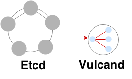
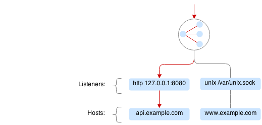
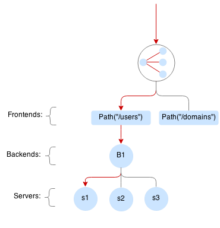
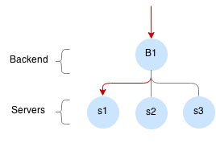
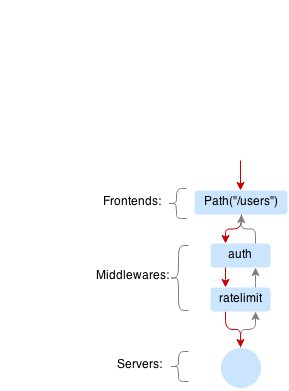

name: inverse
layout: true
class: center, middle, inverse
---
# Управляемый балансировщик
[платформа рассчетных сервисов]
.footnote[Антон Галицын, CD]
---
## История
---
layout: false
background-image: url(images/think.jpg)
.left-column[
  ### История
]
.right-column[
.footnote[Ref: [Взаимодействие расчётных сервисов и API 2GIS](https://confluence.2gis.ru/pages/viewpage.action?pageId=140022055)]
]
---
layout: false
background-image: url(images/waiting.jpg)
.left-column[
  ### История
]
---
layout: false
background-image: url(images/povozka.jpg)
.left-column[
  ### История
]
---
layout: false
background-image: url(images/start.png)
.left-column[
  ### История
]
.right-column[
.footnote[Ref: [Высокоуровневые требования к платформе](https://confluence.2gis.ru/pages/viewpage.action?pageId=141002391)]
]
---
layout: false
background-image: url(images/fun1.jpeg)
.left-column[
  ### История
]
---
.left-column[
  ### Компоненты платформы
]
.right-column[
Инфраструктура:

* Балансировка
* Управление
* Масштабируемость
* Отказоустойчивость
* Мониторинг
* Логирование
* Backing services (база, очередь и тд)

Бекенд сервисы:

* SDK
* Сборка
* Транспорт
* Библиотеки

.footnote[Ref: [Обзор платформы](https://confluence.2gis.ru/pages/viewpage.action?pageId=177996094)]
]
---
layout: false
background-image: url(images/requirements.jpg)
.left-column[
  ### История
]
.right-column[
.footnote[Ref: [Требования по балансировщику](https://confluence.2gis.ru/pages/viewpage.action?pageId=178000063)]
]
---
layout: false
background-image: url(images/frodo.jpg)
.left-column[
  ### История
]
.right-column[
.footnote[Ref: [Research](https://confluence.2gis.ru/pages/viewpage.action?pageId=177999979)]
]
---
template: inverse

## Scope
---
.left-column[
  ### Scope
]
.right-column[

Ограничения:

- только HTTP / HTTPS

- stateless request / response

Особенности:

- API

- Переконфигурирование без перезагрузки

- Failover-логика перенаправления запросов (timeout, HTTP code)

- Управление лимитами (одновременные или суммарные)

- Мониторинг отзывчивости бэкендов (RPS, Latency, HTTP errors, etc)

- Горизонтальная масштабируемость
]
---
.left-column[
  ### Scope
  #### - Поиск решения
]
.right-column[

Рассматриваемые layer 7 балансировщики:

- HAProxy

- Nginx

- What else?

Не рассматриваемые решения:

- Amazon, Rackspace, Google cloud balancers

- em-proxy (ruby), hipache (nodejs), hyperbahn (nodejs)

Интересно:

- Решения на базе IPVS (gorb, seesaw)

.footnote[Ref: [Поиск решений](https://confluence.2gis.ru/pages/viewpage.action?pageId=177999979)]
]
---
template: inverse
background-image: url(images/rock.jpg)

## vulcand
---
.left-column[
  ## vulcand
]
.right-column[

[https://vulcand.github.io/](https://vulcand.github.io/)

> Vulcand is a reverse proxy for HTTP API management and microservices.

.center[]

- OpenSource, golang

- Stateless

- Использует [etcd](https://github.com/coreos/etcd) в качестве хранилища конфигурации

- Есть API и можно писать плагины
]
---
.left-column[
  ## vulcand
  ### listeners
]
.right-column[


> Listener is a dynamic socket that can be attached or detached to Vulcand without restart. Vulcand can have multiple http and https listeners attached to it, providing service on multiple interfaces and protocols.

]
---
.left-column[
  ## vulcand
  ### frontends
]
.right-column[


> Frontends match the requests and forward it to the backends. Each frontend defines a route - a special expression that matches the request, e.g. Path("/v1/path").

]
---
.left-column[
  ## vulcand
  ### backends
]
.right-column[


> Backend (upstream) is a collection of servers, they control connection pools to servers and transport options, such as connection, read and write timeouts.

]
---
.left-column[
  ## vulcand
  ### middleware
]
.right-column[


> Middlewares can intercept or transform the request to any frontend. Examples of the supported middlewares are rate limits and connection limits.

]
---
.left-column[
  ## vulcand
  ### circuit breakers
]
.right-column[


> Circuit breakers are special type of middlewares that observe various metrics for a particular frontend and can activate failover scenario whenever the condition matches e.g. error rate exceeds the threshold.

]
---

##### Usage:

```sh
vulcand

 -apiInterface="":              # apiInterface - interface for API (http/https)
 -apiPort=8182                  # apiPort - port for API

 -etcd=[]                       # etcd - list of etcd discovery service API
 -etcdKey="vulcand"             # etceKey - etcd key for reading configuration

 -log="console"                 # log - console, syslog, json, logstash
 -logSeverity="WARN"            # log severity, DEBUG, INFO, WARN or ERROR
 -pidPath=""                    # path to write PID


 -sealKey=""                    # sealKey is used to store encrypted data in
                                # the backend, use 'vctl secret new_key' to
                                # create a new key.

 -statsdAddr="localhost:8185"   # statsdAddr - address where Vulcand will emit
                                # statsd metrics
 -statsdPrefix="vulcand"        # statsdPrefix is a prefix prepended
                                # to every metric

 -serverMaxHeaderBytes=1048576  # Maximum size of request headers in server
```

---
template: inverse
background-image: url(images/demo.jpg)

## Demo

???

### Build

```sh
make install
```

run etcd from [here](https://gitlab.2gis.ru/docker/etcd)

```sh
make run
```

### Round robin

Run 2 python servers in different terminals
```sh
python -mSimpleHTTPServer 5000
python -mSimpleHTTPServer 5001
```

```sh
cd src/github.com/vulcand/vulcand-bundle

./vctl/vctl backend upsert -id b2
./vctl/vctl server upsert -id srv1 -b b2 -url http://localhost:5000
./vctl/vctl server upsert -id srv2 -b b2 -url http://localhost:5001
./vctl/vctl frontend upsert -id f2 -b b2 -route 'Path("/rr")'
```

Test
```
curl -vi localhost:8181/rr
```

Add failover predicate
```sh
docker exec -t -i etcd /etcdctl set /vulcand/frontends/f2/frontend '{
    "Id": "f2",
    "Type": "http",
    "BackendId": "b2",
    "Route": "Path('/rr')",
    "Settings": {"FailoverPredicate":"(IsNetworkError() || ResponseCode() == 503) && Attempts() <= 4"}
}'
```

Test
```
curl -vi localhost:8181/rr
```

### Rewrite

```sh
./vctl/vctl frontend upsert -id f2 -b b2 -route 'PathRegexp("/rr/.*")'

docker exec -t -i etcd /etcdctl set /vulcand/frontends/f2/middlewares/r1 '{
   "Id":"r1",
   "Priority":1,
   "Type":"rewrite",
   "Middleware":{
      "Regexp":".*",
      "Replacement":"",
      "RewriteBody":false,
      "Redirect":false}}'
```

Test
```
curl -vi localhost:8181/rr/asdasd
```

### Redirect

```sh
./vctl/vctl frontend upsert -id f2 -b b2 -route 'Path("/rr")'

docker exec -t -i etcd /etcdctl set /vulcand/frontends/f2/middlewares/r1 '{
   "Id":"r1",
   "Priority":1,
   "Type":"rewrite",
   "Middleware":{
      "Regexp":"^http://localhost:(.*)/(.*)",
      "Replacement":"http://localhost:$1/",
      "RewriteBody":false,
      "Redirect":true}}'
```

Test
```
curl -vi localhost:8181/rr
```

### Curcuit breaker

See [doc](http://vulcand.github.io/proxy.html#circuit-breakers)

```sh
cd src/github.com/vulcand/vulcand-bundle

./vctl/vctl backend upsert -id b3
./vctl/vctl server upsert -id srv1 -b b3 -url http://localhost:5000
./vctl/vctl server upsert -id srv2 -b b3 -url http://localhost:5001
./vctl/vctl frontend upsert -id f3 -b b3 -route 'Path("/cb")'
```

#### Response fallback

```sh
docker exec -t -i etcd /etcdctl set /vulcand/frontends/f3/middlewares/cb1 '{
 "Id":"cb",
 "Priority":1,
 "Type":"cbreaker",
 "Middleware":{
    "Condition":"NetworkErrorRatio() > 0.5",
    "Fallback":{"Type": "response", "Action": {"StatusCode": 400, "Body": "Come back later"}},
    "FallbackDuration": 10000000000,
    "RecoveryDuration": 10000000000,
    "CheckPeriod": 100000000
 }
}'
```

Down 1 python server on 5000

Test response
```sh
for i in {1..10}; do curl localhost:8181/cb; echo; done
```

#### Redirect fallback

Up python server on 5002

```sh
docker exec -t -i etcd /etcdctl set /vulcand/frontends/f3/middlewares/cb1 '{
 "Id":"cb",
 "Priority":1,
 "Type":"cbreaker",
 "Middleware":{
    "Condition":"NetworkErrorRatio() > 0.1",
    "Fallback":{"Type": "redirect", "Action": {"URL": "http://localhost:5002"}},
    "FallbackDuration": 10000000000,
    "RecoveryDuration": 10000000000,
    "CheckPeriod": 100000000
 }
}'
```

Down 1 python server on 5000

Test response
```
curl -vi localhost:8181/cb
```

#### Network errors & timeout

[Available predicates](http://vulcand.github.io/proxy.html#failover-predicates).

Down 1 python server on 5000

```sh
docker exec -t -i etcd /etcdctl set /vulcand/frontends/f3/middlewares/cb1 '{
 "Id":"cb",
 "Priority":1,
 "Type":"cbreaker",
 "Middleware":{
    "Condition": "NetworkErrorRatio() > 0.1 || LatencyAtQuantileMS(50.0) < 20",
    "Fallback":{"Type": "response", "Action": {"StatusCode": 400, "Body": "Come back later"}},
    "OnTripped": {"Type": "webhook", "Action": {"URL": "http://localhost:5002/", "Method": "GET"}},
    "FallbackDuration": 10000000000,
    "RecoveryDuration": 10000000000,
    "CheckPeriod": 10000000000
 }
}'
```

Up python server on 5002

Test
```sh
for i in {1..20}; do curl -vi localhost:8181/cb; done
```

Up 1 python server on 5000

Test again
```sh
for i in {1..20}; do curl -vi localhost:8181/cb; done
```

#### HTTP code

Down 1 python server on 5000

```sh
docker exec -t -i etcd /etcdctl set /vulcand/frontends/f3/middlewares/cb1 '{
 "Id":"cb",
 "Priority":1,
 "Type":"cbreaker",
 "Middleware":{
    "Condition": "ResponseCodeRatio(500, 600, 0, 600) > 0.2",
    "Fallback":{"Type": "response", "Action": {"StatusCode": 400, "Body": "Come back later"}},
    "OnTripped": {"Type": "webhook", "Action": {"URL": "http://localhost:5002/", "Method": "GET"}},
    "FallbackDuration": 10000000000,
    "RecoveryDuration": 10000000000,
    "CheckPeriod": 10000000000
 }
}'
```

Up python server on 5002

Test
```sh
for i in {1..20}; do curl -vi localhost:8181/cb; done
```

Up 1 python server on 5000

Test again
```sh
for i in {1..20}; do curl -vi localhost:8181/cb; done
```

### Connection limits

See [doc](http://vulcand.github.io/proxy.html#connection-limits)

```sh
cd src/github.com/vulcand/vulcand-bundle

./vctl/vctl backend upsert -id b4
./vctl/vctl server upsert -id srv1 -b b4 -url http://localhost:5000
./vctl/vctl frontend upsert -id f4 -b b4 -route 'Path("/cl")'

docker exec -t -i etcd /etcdctl set /vulcand/frontends/f4/middlewares/cl1\
       '{"Priority": 0, "Type": "connlimit", "Middleware":{"Connections":1, "Variable": "client.ip"}}'
```

Create and run server, which will hold connection

```python
from __future__ import print_function

from pprint import pprint
import logging
import time

import tornado.ioloop
import tornado.web

logging.basicConfig(level=logging.DEBUG)
LOG = logging.getLogger(__name__)


class MyDumpHandler(tornado.web.RequestHandler):
    def _dump_request(self):
        print("# Request:")
        pprint(self.request)

    def get(self):
        sec = 5
        time.sleep(sec)
        LOG.info("Incoming request, hang for %d s", sec)
        self._dump_request()


if __name__ == "__main__":
    port = 5000
    tornado.web.Application([(r"/.*", MyDumpHandler)]).listen(port)
    LOG.info("Start server on %d", port)
    tornado.ioloop.IOLoop.instance().start()
```

Test, in 2 different terminals execute
```sh
for i in {1..5}; do curl -vi localhost:8181/cl; echo; done
```

### Rate limits

See [doc](http://vulcand.github.io/proxy.html#rate-limits)

```sh
cd src/github.com/vulcand/vulcand-bundle

./vctl/vctl backend upsert -id b5
./vctl/vctl server upsert -id srv1 -b b5 -url http://localhost:5000
./vctl/vctl frontend upsert -id f5 -b b5 -route 'Path("/rl")'

docker exec -t -i etcd /etcdctl set /vulcand/frontends/f5/middlewares/rl1 '{
   "Id":"rl1",
   "Priority":0,
   "Type":"ratelimit",
   "Middleware":{
      "PeriodSeconds":1,
      "Requests":1,
      "Burst":2,
      "Variable":"client.ip"}}'
```

Test
```sh
for i in {1..5}; do curl -i localhost:8181/rl; echo; done
```

### Logs

- `-log=syslog`

- `-log=logstash`

Example: Open [kibana](http://deis-kibana.deis.n1.nato/) and discover in `[staging-agalitsyn-]YYYY.MM.DD` index.

#### Trace

See [doc](http://vulcand.github.io/proxy.html#structured-logs)

```sh
docker exec -t -i etcd /etcdctl set /vulcand/frontends/f6/middlewares/t1 '{
  "Id":"t1",
  "Priority":1,
  "Type":"trace",
  "Middleware":{
    "ReqHeaders":["X-A","X-B"],
    "RespHeaders":["X-C","X-D"],
    "Addr":"syslog://"}}'
```

### Metrics

```sh
vctl top
```

#### Statsd integration

See [doc](http://vulcand.github.io/proxy.html#startup-and-configuration).

Run [graphite-statsd](https://hub.docker.com/r/hopsoft/graphite-statsd/) docker image.

```sh
docker run -d --name graphite --restart=always -p 80:80 -p 2003:2003 -p 8125:8125/udp -p 8126:8126 hopsoft/graphite-statsd
```

Open Graphite in a browser at http://localhost.

Search in:
* stats.timers.vulcan
* stats.gauges.vulcan

---
.left-column[
  ### Scope
  #### Дальнейшие действия
]
.right-column[

- Middleware для зеркалирования траффика

- Централизованное логирование и метрики

- Алгоритм балансировки Weighted Random

- Интеграция в Deis

- Алгоритм балансировки Least time (first response)

- Нагрузочное тестирование

.footnote[Ref: [Jira CD-1063](https://jira.2gis.ru/browse/CD-1063)]
]
---
layout: false
background-image: url(images/fellowship.jpg)
.left-column[
  ### Вопросы?
]
